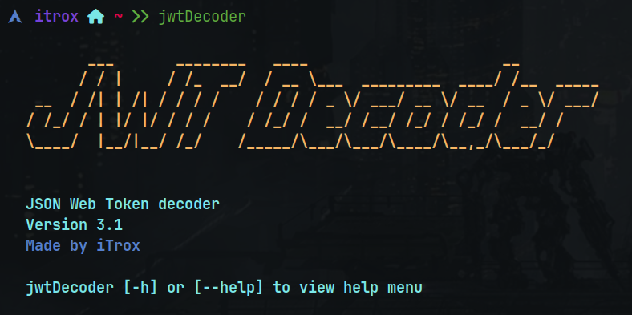

# jwt-Decoder



Bash script to decode JSON Web Tokens

---

## Symbolic Link

* To use the system-level tool as an executable from a relative path, it is recommended to create a symbolic link to the /usr/bin directory from your repository directory.

```shell
chmod +x jwtDecoder.sh
sudo ln -s /path/to/repository/jwt-Decoder/jwtDecoder.sh /usr/bin/jwtDecoder
```

---

## Use

* To know the options and parameters of the tool run the help menu with the flag `-h` or `--help`.

```shell
bugHunterx -h
```

```shell
bugHunterx --help
```


---
