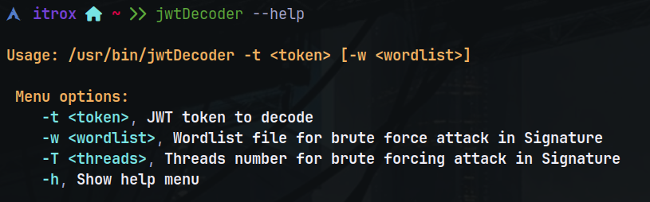
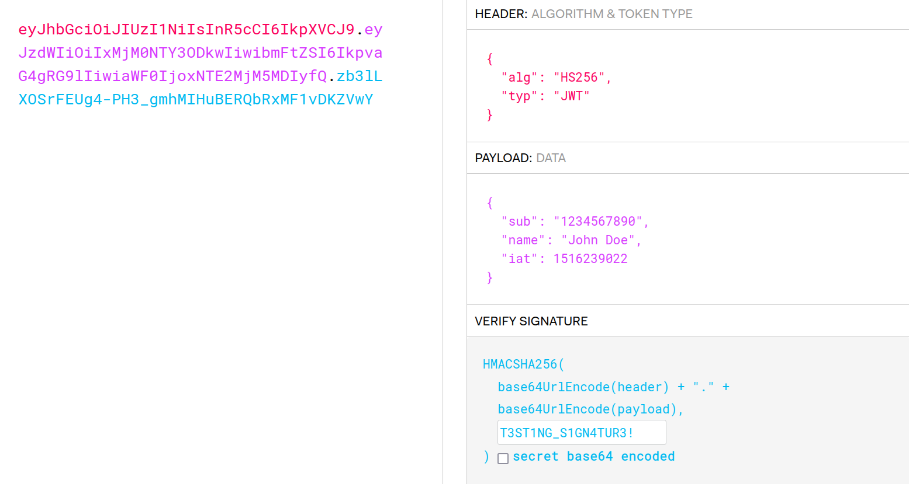

# jwt-Decoder


Bash script that decodes JWT tokens, in normal format or fully Base64-encoded.

---

## Install tool

* Download the repository to your system

```shell
sudo git -C /opt clone https://github.com/iTroxB/jwt-Decoder.git
```

* Install the requirements by running **requirements.sh**

```shell
sudo bash /opt/jwt-Decoder/requirements.sh
```

* To use the system-level tool as an executable from a relative path, it is recommended to create a symbolic link to the /usr/bin directory from your repository directory.

```shell
sudo chmod +x /opt/jwt-Decoder/jwtDecoder.sh
sudo ln -s /opt/jwt-Decoder/jwtDecoder.sh /usr/bin/jwtDecoder
```

* To know the options and parameters of the tool run the help menu with the flag `-h` or `--help`.

```shell
jwtDecoder -h
```

```shell
jwtDecoder --help
```



---

## Use tool

- Example of JWT without signature secret

<div align="center">
  
</div>

- Example of JWT with secret signature "JSON-WEB-TOKEN"



---

---

- Example with regular JWT token


- Example with the same JWT token as above but Base64-encrypted


---
